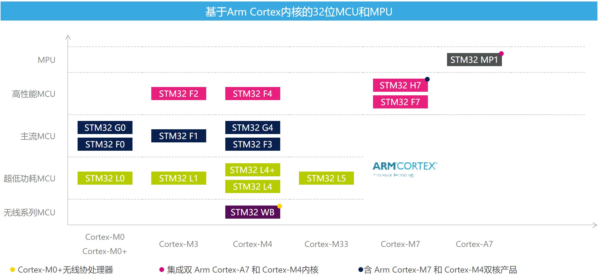
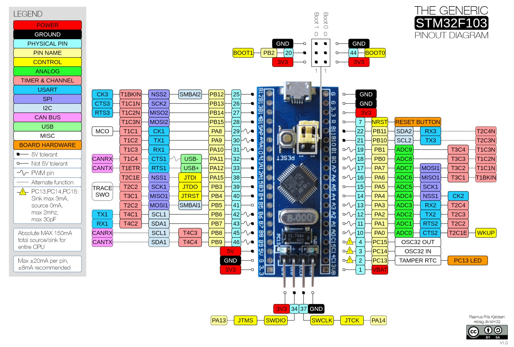
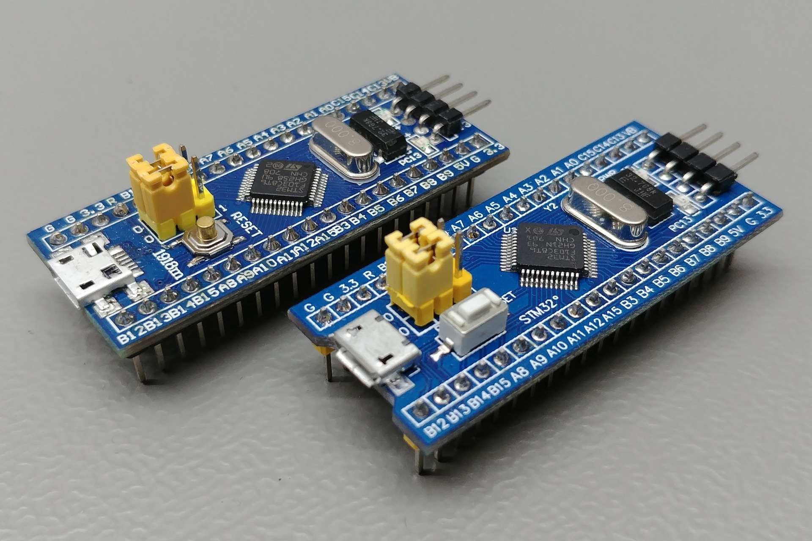
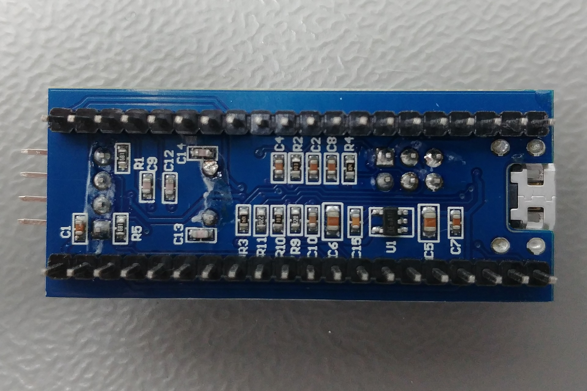

# STM32 Blue Pill

> 基于 STM32F103C8T6 的"蓝色药丸"核心板软硬件资料整理。

**STM32** 是 ST 公司开发的一款高性能、低功耗的 32 位微控制器。市面上非常流行的 "Blue Pill" 核心板基于 STM32F103C8T6 设计，采用 DIP40 封装，体积小巧、价格低廉（参考价 ¥10），保留了基本的定时器、串口、I²C、SPI、JTAG/SWD 调试接口，国内开发者社区资料也非常丰富。

本仓库收集并整理了与 Blue Pill 相关的参考资料、原理图、数据手册、开发工具以及若干 Clion 工程示例，方便日后查阅与开发。

> 部分资料来源于网络，正文中会附原始链接。为防链接失效，重要资料另存了一份。如有侵权请联系 3537124715@qq.com 删除。

---

## 仓库结构

```
STM32-Blue-Pill/
├── Hardware/      核心板硬件相关：原理图、PCB 封装、尺寸图
├── Images/        README 与文档中引用的图片
├── PDF/           STM32 官方手册、数据手册、选型指南等 PDF 资料
├── Projects/      Keil MDK 开发示例工程
├── Tools/         开发辅助工具：下载器 mcuisp、代码格式化 AStyle
├── LICENSE        开源协议
└── readme.md      当前文档
```

### `Hardware/` — 核心板硬件资料
| 文件 | 说明 |
| --- | --- |
| `STM32F103C8T6核心板-电路原理图.PDF` | Blue Pill 核心板原理图 |
| `STM32F103C8T6核心板-尺寸图.pdf` | 核心板物理尺寸图 |
| `STM32F103C8T6核心板--尺寸图（PCB格式）.rar` | PCB 格式的尺寸图 |
| `STM32F103C8T6核心板--原理图封装库.rar` | 原理图元件封装库 |
| `STM32F103C8T6核心板--PCB封装库.rar` | PCB 元件封装库 |

### `Images/` — 文档配图
存放本仓库 Markdown 文档（主要是本 README）所引用的图片，包括 STM32 分类图、Blue Pill 实物图、引脚图、ST-Link 接线图、板级支持包下载示意图等。

### `PDF/` — 参考手册与数据手册
| 文件 | 说明 |
| --- | --- |
| `Selection_Guide.pdf` | STM32 全系列选型手册 |
| `STM32参考手册.pdf` | STM32F10x 系列参考手册 |
| `STM32F103x8、STM32F103xB数据手册 .pdf` | STM32F103C8T6 数据手册 |
| `The-Generic-STM32F103-Pinout-Diagram.pdf` | STM32F103 通用引脚图 |
| `DS9193.pdf` | 核心板上 RT9193 稳压器数据手册 |

### `example/` — Clion 开发示例
| 子目录 | 说明 |
| --- | --- |
| `example_F103_LED` | 板载小灯 |

---

## 关于芯片

ST 公司基于不同的 Cortex 内核开发了多个系列的 STM32 单片机，Blue Pill 上搭载的是 **STM32F103C8T6**，属于 Cortex®-M3 内核的 F1 系列。

> 选型时可参考 [`PDF/Selection_Guide.pdf`](./PDF/Selection_Guide.pdf)。

<div align="center">

</div>

### 处理器资源
STM32F103C8T6 内置 20 KB RAM、64 KB ROM，外设包括：3×USART、2×硬件 I²C、2×硬件 SPI、1×CAN、1 个高级定时器（TIM1）、3 个通用定时器（TIM2/3/4）、1×SysTick、1×独立看门狗、1×温度传感器，以及若干 GPIO。最高时钟频率 72 MHz。

<div align="center">

</div>

> 图中部分接口重复是因为 STM32 端口可以复用，可将某端口映射到其他端口使用。

### 核心板硬件
<div align="center">


</div>

Blue Pill 外接 5 V 即可独立工作，可通过 5V/GND 引脚或板载 micro-USB 接口供电（USB 的 5V 直连核心板 5V 引脚）。板载 RT9193 稳压芯片将电压降至 3.3 V 为 MCU 供电，也可为外接模块（如 I²C OLED）供电。

---

## 参考链接
- [ST 中国 - 官网](https://www.stmcu.com.cn/)
- [Keil 官网](https://www.keil.com/)
- [板级支持包](https://www.keil.com/dd2/pack/)
- [正点原子](http://www.alientek.com/)
- [开源电子网 - 正点原子](http://www.openedv.com/)
- [源地工作室](http://www.vcc-gnd.com/rtd/html/index.html)
- [stm32-base](https://stm32-base.org/)

