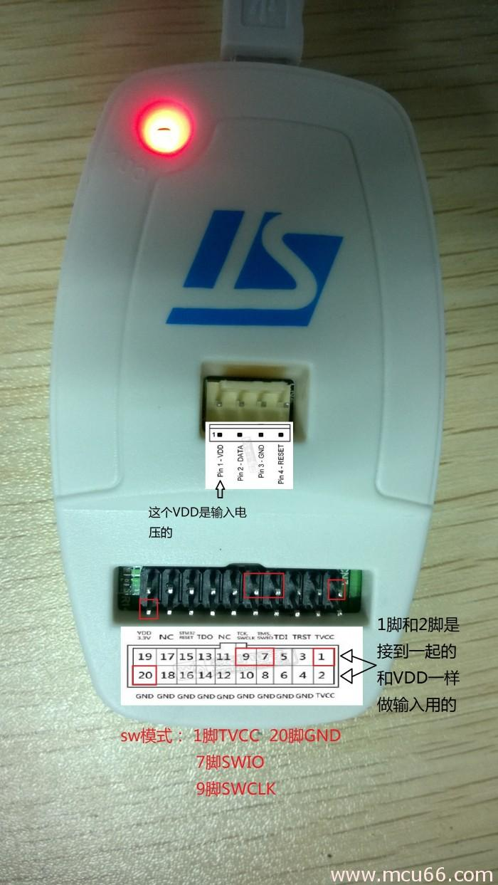
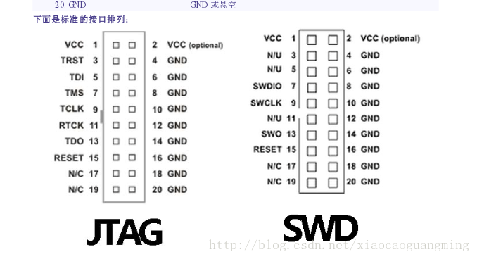

# STM32 Blue Pill

> 基于 STM32F103C8T6 的"蓝色药丸"核心板软硬件资料整理。

**STM32** 是 ST 公司开发的一款高性能、低功耗的 32 位微控制器。市面上非常流行的 "Blue Pill" 核心板基于 STM32F103C8T6 设计，采用 DIP40 封装，体积小巧、价格低廉（参考价 ¥10），保留了基本的定时器、串口、I²C、SPI、JTAG/SWD 调试接口，国内开发者社区资料也非常丰富。

本仓库收集并整理了与 Blue Pill 相关的参考资料、原理图、数据手册、开发工具以及若干 Keil 工程示例，方便日后查阅与开发。

> 部分资料来源于网络，正文中会附原始链接。为防链接失效，重要资料另存了一份。如有侵权请联系 siyouluo11@gmail.com 删除。

---

## 仓库结构

```
STM32-Blue-Pill/
├── Hardware/      核心板硬件相关：原理图、PCB 封装、尺寸图
├── Images/        README 与文档中引用的图片
├── PDF/           STM32 官方手册、数据手册、选型指南等 PDF 资料
├── Projects/      Keil MDK 开发示例工程
├── Tools/         开发辅助工具：下载器 mcuisp、代码格式化 AStyle
├── LICENSE        开源协议
└── readme.md      当前文档
```

### `Hardware/` — 核心板硬件资料
| 文件 | 说明 |
| --- | --- |
| `STM32F103C8T6核心板-电路原理图.PDF` | Blue Pill 核心板原理图 |
| `STM32F103C8T6核心板-尺寸图.pdf` | 核心板物理尺寸图 |
| `STM32F103C8T6核心板--尺寸图（PCB格式）.rar` | PCB 格式的尺寸图 |
| `STM32F103C8T6核心板--原理图封装库.rar` | 原理图元件封装库 |
| `STM32F103C8T6核心板--PCB封装库.rar` | PCB 元件封装库 |

### `Images/` — 文档配图
存放本仓库 Markdown 文档（主要是本 README）所引用的图片，包括 STM32 分类图、Blue Pill 实物图、引脚图、ST-Link 接线图、板级支持包下载示意图等。

### `PDF/` — 参考手册与数据手册
| 文件 | 说明 |
| --- | --- |
| `Selection_Guide.pdf` | STM32 全系列选型手册 |
| `STM32参考手册.pdf` | STM32F10x 系列参考手册（中文）|
| `STM32F103x8、STM32F103xB数据手册 .pdf` | STM32F103C8T6 数据手册 |
| `The-Generic-STM32F103-Pinout-Diagram.pdf` | STM32F103 通用引脚图 |
| `DS9193.pdf` | 核心板上 RT9193 稳压器数据手册 |

### `Projects/` — Keil MDK 开发例程
| 子目录 | 说明 |
| --- | --- |
| `1.MDK install&setup/` | MDK5（Keil5）安装与配置笔记，含中文乱码、AStyle 代码格式化等小贴士 |
| `2.KeilProject-LED/` | 标准库函数模板：点亮板载 LED，可作为后续工程的起点模板 |
| `KeilProject-FLASH/` | FLASH 模拟 E²PROM 示例，并集成了 BEEP / KEY / OLED / DS18B20 / 舵机 / 指纹模块等多个外设驱动 |

每个工程的典型目录约定：
- `USER/` — `main.c`、中断处理、工程文件（`.uvprojx`）
- `CORE/` — Cortex-M3 启动文件与 CMSIS 内核文件
- `SYSTEM/` — 常用底层封装（延时、串口、时钟等）
- `STM32F10x_FWLib/` — ST 官方标准外设库
- `HARDWARE/` — 各外设模块驱动（LED、OLED、KEY 等）
- `keilkilll.bat` — 一键清理 Keil 编译产生的中间文件

### `Tools/` — 开发辅助工具
| 文件 | 说明 |
| --- | --- |
| `mcuisp.exe` | 通过 USART 串口下载 HEX 程序的工具（Windows）|
| `mcuispConfig.ini` | mcuisp 的配置文件 |
| `AStyle.zip` | C/C++ 代码格式化工具 AStyle，可集成进 Keil5 |

---

## 关于芯片

ST 公司基于不同的 Cortex 内核开发了多个系列的 STM32 单片机，Blue Pill 上搭载的是 **STM32F103C8T6**，属于 Cortex®-M3 内核的 F1 系列。

> 选型时可参考 [`PDF/Selection_Guide.pdf`](./PDF/Selection_Guide.pdf)。

<div align="center">

</div>

### 处理器资源
STM32F103C8T6 内置 20 KB RAM、64 KB ROM，外设包括：3×USART、2×硬件 I²C、2×硬件 SPI、1×CAN、1 个高级定时器（TIM1）、3 个通用定时器（TIM2/3/4）、1×SysTick、1×独立看门狗、1×温度传感器，以及若干 GPIO。最高时钟频率 72 MHz。

<div align="center">

</div>

> 图中部分接口重复是因为 STM32 端口可以复用，可将某端口映射到其他端口使用。

### 核心板硬件
<div align="center">


</div>

Blue Pill 外接 5 V 即可独立工作，可通过 5V/GND 引脚或板载 micro-USB 接口供电（USB 的 5V 直连核心板 5V 引脚）。板载 RT9193 稳压芯片将电压降至 3.3 V 为 MCU 供电，也可为外接模块（如 I²C OLED）供电。

---

## 程序下载方式

**1. 通过 USART 串口下载**
```
BOOT0 -> 1
BOOT1 -> 0
USB-TTL GND -> 核心板 GND
USB-TTL 5V  -> 核心板 5V
USB-TTL TX  -> 核心板 RX (PA10)
USB-TTL RX  -> 核心板 TX (PA9)
```
按一下 RST 复位键，使用 [`Tools/mcuisp.exe`](./Tools/) 下载 HEX 文件。

**2. 通过 ST-Link 下载**
ST-Link 不能为核心板供电，需另外供电（推荐 micro-USB），在 Keil5 中点击 Download 即可。
<div align="center">


</div>

**3. 通过板载 micro-USB 下载**（待验证）
参考 [这篇文章](https://medium.com/@paramaggarwal/programming-an-stm32f103-board-using-usb-port-blue-pill-953cec0dbc86)。

相关资料：
- [核心板原理图](./Hardware/STM32F103C8T6核心板-电路原理图.PDF)
- [RT9193 稳压器数据手册](./PDF/DS9193.pdf)

---

## 快速开始

1. 安装 Keil MDK5，详见 [`Projects/1.MDK install&setup/readme.md`](./Projects/1.MDK%20install&setup/readme.md)
2. 打开 [`Projects/2.KeilProject-LED`](./Projects/2.KeilProject-LED) 中的 `.uvprojx`，编译并下载，验证开发环境
3. 参考 [`Projects/KeilProject-FLASH`](./Projects/KeilProject-FLASH) 中各外设驱动展开自己的项目

---

## 参考链接
- [ST 中国 - 官网](https://www.stmcu.com.cn/)
- [Keil 官网](https://www.keil.com/)
- [板级支持包](https://www.keil.com/dd2/pack/)
- [正点原子](http://www.alientek.com/)
- [开源电子网 - 正点原子](http://www.openedv.com/)
- [源地工作室](http://www.vcc-gnd.com/rtd/html/index.html)
- [stm32-base](https://stm32-base.org/)

---

## License
本仓库遵循根目录 [LICENSE](./LICENSE) 文件中的开源协议。
